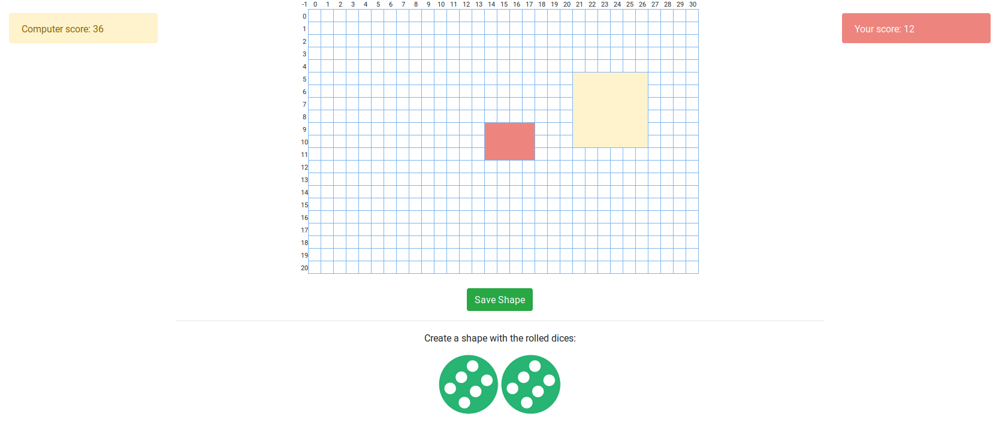

<h4>Squares game</h4>
 
<h5>Create some shapes</h5>

Game rules and logic:

	Human VS Computer. There are two dices with values from 2 to 6. <i>Number 1 is excluded due to game rules.</i>

<ul>
	<li>Two dices are rolled.</li>
	<li>Make a rectangle or a square with te sides generated.</li>
	<li>When all space is filled the game is completed.</li>
	<li>If computer or player can't create a shape, it's the opponents' turn to play.</li>
	<li>After creating a shape, click the green button to save it.</li>
</ul>